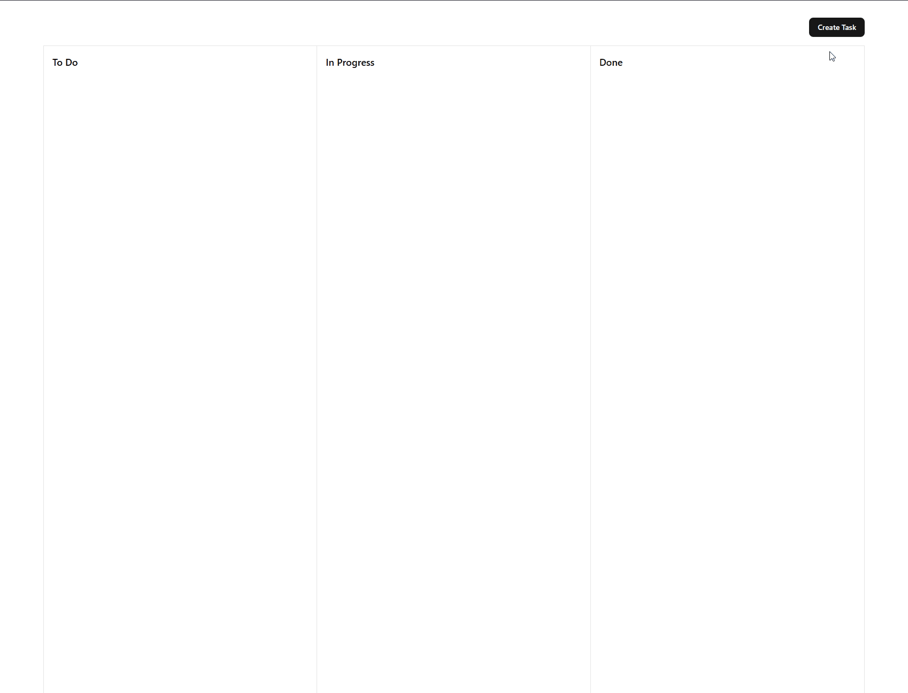

# 📝 TODO-APP

_Transform Tasks into Triumphs Every Day_


---

## 📸 Демо

## 

## 🚀 Возможности

-   ✅ Добавление, редактирование и удаление задач
-   🔄 Drag-and-drop перестановка задач (react-selecto)
-   ⚡ Мгновенное обновление данных через RTK Query
-   🎨 Удобный и адаптивный UI на базе shadcn UI
-   📂 Чёткое разделение фронтенда и бэкенда

---

## 📚 Стек технологий

### **Frontend**


### **Backend**


### **Other**


---

## 📦 Установка и запуск

```bash
# 1. Клонируем проект
git clone https://github.com/ManoilAlexandr/todo-app.git
cd todo-app

# 2. Устанавливаем зависимости фронтенда
cd client
npm install

# 3. Запускаем фронтенд
npm start

# 4. Устанавливаем зависимости бэкенда
cd ../server
npm install

# 5. Запускаем бэкенд
npm start
```
